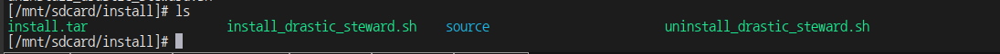
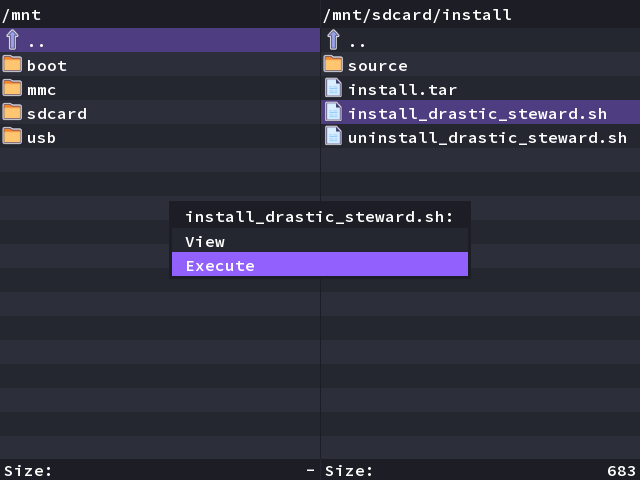
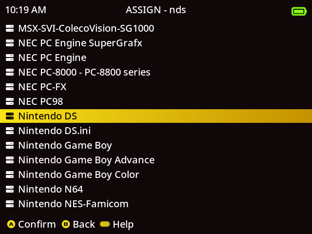
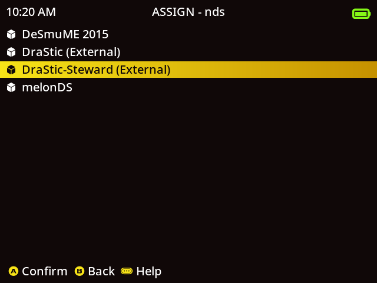

# drastic-stewrad for rg35xxh

[If it helped you](https://ko-fi.com/trngaje)

# batocera

In the path below, you can download batocera containing drastic-steward.

[link](https://github.com/trngaje/rg35xxh_binary/releases/tag/240601)

# muos

## drastic_steward

### Table of Contents
[1.Changes compared to the original onion-drastic custom for miyoomini, A30](#Changes-compared-to-the-original-onion-drastic-custom-for-miyoomini,-A30)

[2.how to install](#how-to-install)

[3.defined key](#defined-key)

[4.modify input](#modifiy-input)

### Changes compared to the original onion-drastic custom for miyoomini, A30

    1.add dpad-hat input processing
    2.apply to rg35xx-p/h display (miyoomini is implemented as a 180-degree rotated display mounted screen, so it is changed)
    3.change the save path (/userdata/saves/nds/drastic/)
    4.use as dpad input on right analog stick 90 degree screen
    5.add Korean to language script and replace with Korean-enabled fonts
    6.implement left analog stick and right analog stick to move touch on the normal display mode

### how to install

1.download below file

[link](https://github.com/trngaje/rg35xxh_binary/releases/download/240601/install.tar.gz)

2.unzip file and copy it to device

3.excute install by dingux command or command line
(some of files will be removed after install)

4.assign nds by drastic_steward

### defined key

    Hotkey - mode key (can be changed from custom setting to select)
    Hotkey + left / right: Change the display mode
    Hotkey + up / down: Change touch cursor screen
    Hotkey + b : pixel / blur
    Hotkey + y : Change the theme
    Hotkey + select : Display the original drastic setting screen
    Hotkey + start: Display custom setting screen
    Hotkey + r1 : Fast Forward
    Hotkey + l1 : exit
    
    l2 : Display touch cursor
    r2 : swap Screen

    left analog stick : move touch cursor
    r3 : touch button pressed

### modifiy input

i add parameters in settings.json to replace with new input (ex. keyboard)
all default value is setup for rg35xxh.

     "input_dev":"\/dev\/input\/event2",
      "input_up":103,
      "input_down":108,
      "input_left":105,
      "input_right":106,
      "input_a":57,
      "input_b":29,
      "input_x":42,
      "input_y":56,
      "input_l1":18,
      "input_r1":20,
      "input_l2":15,
      "input_r2":14,
      "input_l3":5,
      "input_r3":6    
      "input_select":97,
      "input_start":28,
      "input_menu":125,
      "input_qsave":11,
      "input_qload":2,
      "input_ff":3,
      "input_exit":4,
      "input_menu_onion":59,

code value in evtest

      Event: time 1717073766.640482, type 1 (EV_KEY), code 103 (KEY_UP), value 0

Keyboard key values were assigned the same as Miu Mini.

nds button | keyboard button
------ | ---------------------
up | up
down | down
left | left
right | right
a | space
b | lctrl
x | lshift
y | lalt
l | e
r | t
l2 | tab
r2 | backspace
l3 | 4
r3 | 5
select | rctrl
start | return
menu | window
quick save | 0
quick load | 1
fast forward | 2
exit | 3

> reference

Steward-fu initially implemented to allow the skin to be overlaid on the nds game screen for the miyoo mini.I've only made some modifications for use with the rg35xx-h device.

Below is the original source path.

[https://github.com/steward-fu/nds](https://github.com/steward-fu/nds)
