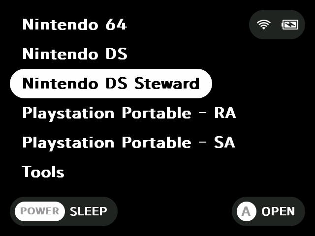
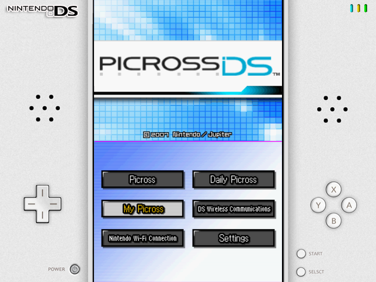

# drastic-stewrad for rg35xx h/p, minui

[If it helped you](https://ko-fi.com/trngaje)

# minui

## drastic_steward

### Table of Contents
[1.Changes compared to the original onion-drastic custom for miyoomini, A30](#Changes-compared-to-the-original-onion-drastic-custom-for-miyoomini,-A30)

[2.how to install](#how-to-install)

[3.defined key](#defined-key)

### Changes compared to the original onion-drastic custom for miyoomini, A30

    1.add dpad-hat input processing
    2.apply to rg35xx-p/h display (miyoomini is implemented as a 180-degree rotated display mounted screen, so it is changed)
    3.change the save path (/userdata/saves/nds/drastic/)
    4.use as dpad input on right analog stick 90 degree screen
    5.add Korean to language script and replace with Korean-enabled fonts
    6.implement left analog stick and right analog stick to move touch on the normal display mode
    7.fix to display touch cursor only on screen1

### how to install

1.download below file

[link](https://github.com/trngaje/rg35xxh_binary/releases/download/240614/minui_drastic_steward.tar.gz)

2.unzip file and copy it to your device

    ├── Emus
    │   └── rg35xxplus
    │       └── DSS.pak
    └── Roms
        └── Nintendo DS Steward(DSS)
            └── deleteme.txt

3.Select the steward folder

4.Run the nds game

### defined key

    Hotkey - mode key (can be changed from custom setting to select)
    Hotkey + left / right: Change the display mode
    Hotkey + up / down: Change touch cursor screen
    Hotkey + b : pixel / blur
    Hotkey + y : Change the theme
    Hotkey + select : Display the original drastic setting screen
    Hotkey + start: Display custom setting screen
    Hotkey + r1 : Fast Forward
    Hotkey + l1 : exit

    l2 : Display touch cursor
    r2 : swap Screen

    left analog stick : move touch cursor
    r3 : touch button pressed

> reference

Steward-fu initially implemented to allow the skin to be overlaid on the nds game screen for the miyoo mini.I've only made some modifications for use with the rg35xx-h device.

Below is the original source path.

[https://github.com/steward-fu/nds](https://github.com/steward-fu/nds)
